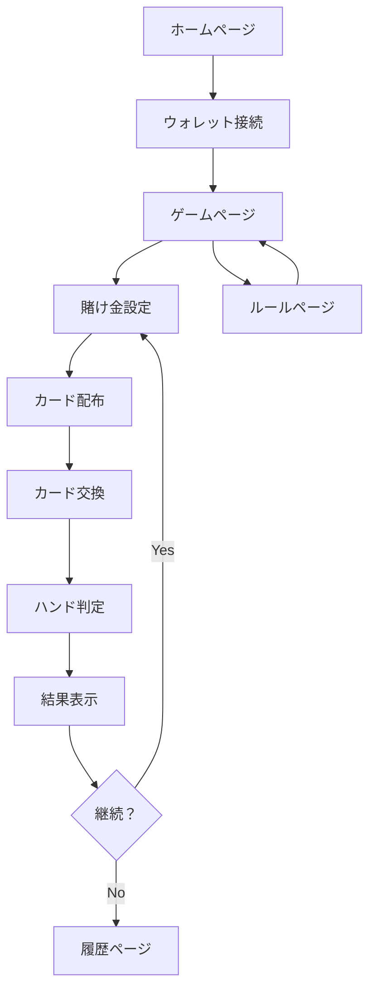

# Web3ポーカーミニゲーム 要件定義書

## 1. プロダクト概要

Base Sepolia上で動作するトークンベースの5カードドローポーカーゲーム。プレイヤーは賭けトークンを使ってポーカーゲームを楽しみ、勝利時にはトークンを獲得、敗北時にはトークンを失うギャンブル要素を持つWeb3ミニゲームです。

Farcaster Frame対応により、ソーシャルメディア上で簡単にアクセス可能で、Base Mini Appの機能を活用して数百万のユーザーにリーチできる革新的なゲーム体験を提供します。

TRAE 1dayハッカソンでの入賞を目指し、技術的な完成度とユーザー体験の両面で高品質なプロダクトを目指します。

## 2. コア機能

### 2.1 ユーザーロール

| ロール | 登録方法 | 主要権限 |
|--------|----------|----------|
| プレイヤー | ウォレット接続 | ゲームプレイ、トークン賭け、履歴閲覧 |
| ゲストユーザー | なし | ゲーム観戦、ルール確認 |

### 2.2 機能モジュール

本ポーカーゲームは以下の主要ページで構成されます：

1. **ホームページ**: ゲーム概要、ウォレット接続、ゲーム開始ボタン
2. **ゲームページ**: ポーカーゲーム本体、カード表示、賭け金設定
3. **履歴ページ**: ゲーム履歴、勝敗記録、獲得トークン履歴
4. **ルールページ**: ゲームルール説明、ポーカーハンド一覧

### 2.3 ページ詳細

| ページ名 | モジュール名 | 機能説明 |
|----------|-------------|----------|
| ホームページ | ヒーローセクション | ゲームタイトル、キャッチコピー、プレイボタン表示 |
| ホームページ | ウォレット接続 | Base Sepoliaネットワークへの接続、残高表示 |
| ホームページ | 統計表示 | 総プレイヤー数、総賭け金額、最高賞金の表示 |
| ゲームページ | カード表示エリア | 5枚のカードを表示、選択・交換機能 |
| ゲームページ | 賭け金設定 | トークン数入力、最小・最大賭け金制限 |
| ゲームページ | ゲーム制御 | ドロー、ホールド、ベット、フォールドボタン |
| ゲームページ | ハンド判定 | ポーカーハンドの自動判定と表示 |
| ゲームページ | 結果表示 | 勝敗結果、獲得・損失トークン表示 |
| 履歴ページ | ゲーム履歴 | 過去のゲーム結果一覧、日時・賭け金・結果表示 |
| 履歴ページ | 統計情報 | 勝率、総獲得トークン、最高ハンド記録 |
| ルールページ | ルール説明 | 5カードドローポーカーのルール詳細説明 |
| ルールページ | ハンド一覧 | ポーカーハンドの種類と強さ、配当倍率 |

## 3. コアプロセス

### プレイヤーフロー

1. **ゲーム開始**: ホームページでウォレット接続→ゲームページへ遷移
2. **賭け金設定**: トークン数を入力→ゲーム開始ボタンをクリック
3. **初期カード配布**: 5枚のカードが自動配布される
4. **カード交換**: 不要なカードを選択→ドローボタンで新しいカードと交換
5. **ハンド判定**: 最終的な5枚のカードでポーカーハンドを自動判定
6. **結果確定**: ハンドの強さに応じて配当計算→トークン増減
7. **次ゲーム**: 継続プレイまたはゲーム終了を選択

## 4. ユーザーインターフェースデザイン

### 4.1 デザインスタイル

- **プライマリカラー**: #0052ff (Base Blue)
- **セカンダリカラー**: #22c55e (Success Green), #ef4444 (Error Red)
- **ボタンスタイル**: 角丸（8px）、グラデーション効果、ホバーアニメーション
- **フォント**: 'Pixelify Sans' (ゲーム感)、システムフォント（可読性重視部分）
- **レイアウトスタイル**: カードベース、中央寄せ、モバイルファースト
- **アイコンスタイル**: トランプカードモチーフ、コイン・トークンアイコン

### 4.2 ページデザイン概要

| ページ名 | モジュール名 | UI要素 |
|----------|-------------|--------|
| ホームページ | ヒーローセクション | 大きなタイトル、アニメーション背景、CTAボタン（グラデーション） |
| ホームページ | ウォレット接続 | 接続ボタン、残高表示カード、ネットワーク状態インジケーター |
| ゲームページ | カード表示 | 5枚のカード（アニメーション付き）、選択状態の視覚的フィードバック |
| ゲームページ | 賭け金設定 | 数値入力フィールド、プリセットボタン、残高表示 |
| ゲームページ | 制御ボタン | 大きなアクションボタン、状態に応じた色変化、ローディング表示 |
| 履歴ページ | 履歴リスト | テーブル形式、勝敗による色分け、ページネーション |
| ルールページ | ルール説明 | アコーディオン形式、図解付き、分かりやすいアイコン |

### 4.3 レスポンシブ対応

モバイルファーストデザインを採用し、スマートフォン（375px〜）、タブレット（768px〜）、デスクトップ（1024px〜）に対応。タッチ操作に最適化されたボタンサイズ（最小44px）とジェスチャー操作をサポート。