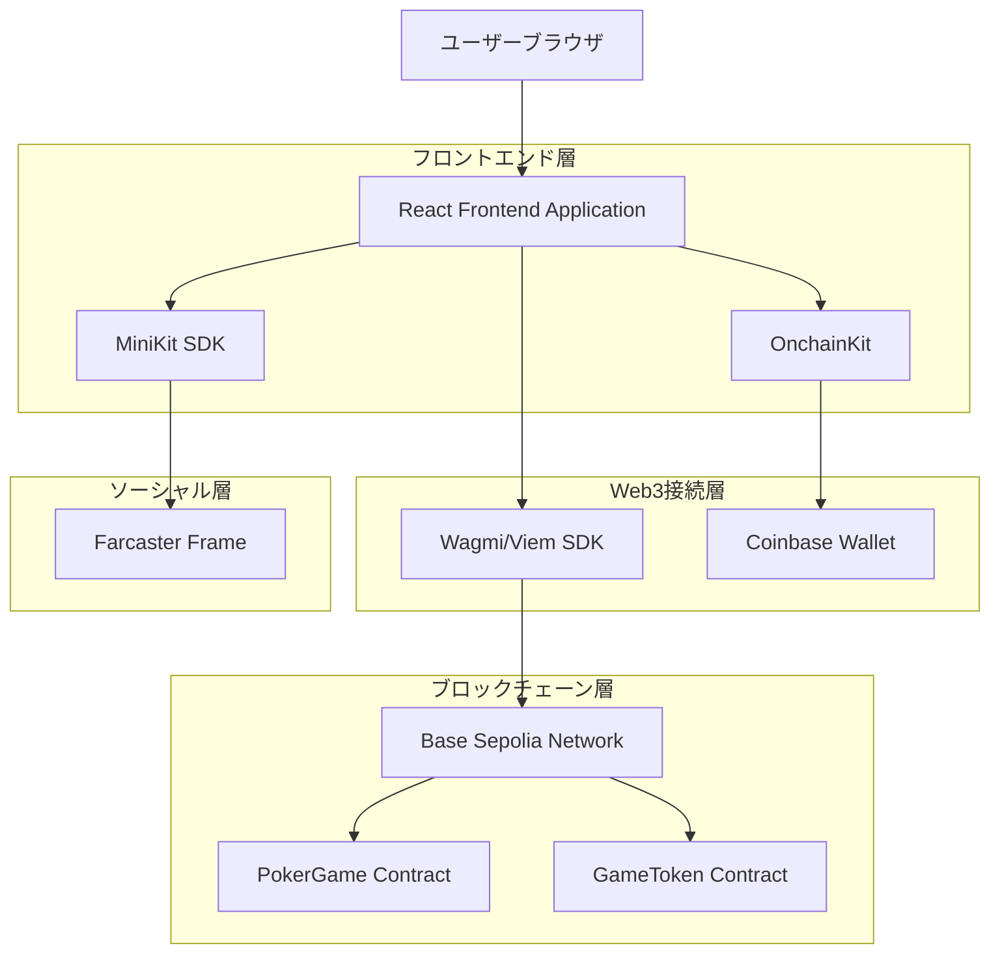
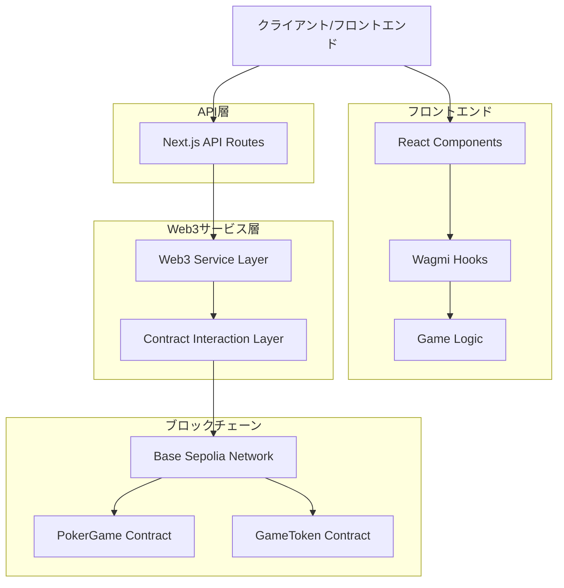
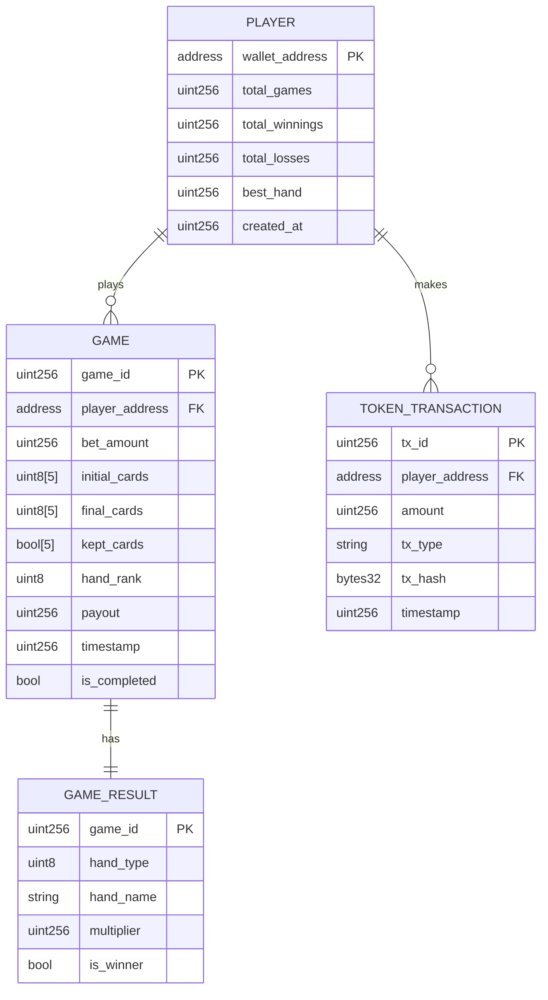

# Web3ポーカーミニゲーム 技術設計書

## 1. アーキテクチャ設計



## 2. 技術スタック

- **フロントエンド**: React@18 + Next.js@15 + TypeScript + TailwindCSS@3 + Vite
- **Web3ライブラリ**: wagmi@2 + viem@2 + @coinbase/onchainkit@latest
- **フレームワーク**: @farcaster/frame-sdk@0.1.8
- **状態管理**: React useState + @tanstack/react-query@5
- **スタイリング**: TailwindCSS + カスタムCSS
- **ブロックチェーン**: Base Sepolia
- **パッケージマネージャー**: pnpm

## 3. ルート定義

| ルート | 目的 |
|--------|------|
| / | ホームページ、ゲーム概要とウォレット接続 |
| /game | メインゲームページ、ポーカーゲーム実行 |
| /history | ゲーム履歴ページ、過去の結果表示 |
| /rules | ルール説明ページ、ゲームルールとハンド一覧 |
| /api/webhook | Farcaster Frameのwebhook処理 |
| /api/notify | 通知システム用API |
| /.well-known/farcaster.json | Farcasterメタデータ設定 |

## 4. スマートコントラクト設計

### 4.1 コアAPI

**ゲーム開始**
```solidity
function startGame(uint256 betAmount) external payable
```

リクエスト:
| パラメータ名 | パラメータ型 | 必須 | 説明 |
|-------------|-------------|------|------|
| betAmount | uint256 | true | 賭けるトークン数量 |

レスポンス:
| パラメータ名 | パラメータ型 | 説明 |
|-------------|-------------|------|
| gameId | uint256 | ゲームID |
| initialCards | uint8[5] | 初期カード（0-51の数値） |

**カード交換**
```solidity
function drawCards(uint256 gameId, bool[5] memory keepCards) external
```

リクエスト:
| パラメータ名 | パラメータ型 | 必須 | 説明 |
|-------------|-------------|------|------|
| gameId | uint256 | true | ゲームID |
| keepCards | bool[5] | true | 各カードを保持するかのフラグ |

レスポンス:
| パラメータ名 | パラメータ型 | 説明 |
|-------------|-------------|------|
| finalCards | uint8[5] | 最終カード |
| handRank | uint8 | ハンドランク（0-9） |
| payout | uint256 | 配当金額 |

**ゲーム履歴取得**
```solidity
function getPlayerHistory(address player) external view returns (GameResult[] memory)
```

### 4.2 フロントエンドAPI

**ゲーム状態管理**
```typescript
interface GameState {
  gameId: bigint | null;
  cards: number[];
  selectedCards: boolean[];
  betAmount: bigint;
  gamePhase: 'betting' | 'initial' | 'draw' | 'result';
  handRank: number;
  payout: bigint;
}
```

**カード表現**
```typescript
interface Card {
  suit: 'hearts' | 'diamonds' | 'clubs' | 'spades';
  rank: number; // 1-13 (A, 2-10, J, Q, K)
  selected: boolean;
}
```

## 5. サーバーアーキテクチャ図



## 6. データモデル

### 6.1 データモデル定義



### 6.2 スマートコントラクト定義

**PokerGameコントラクト**
```solidity
// SPDX-License-Identifier: MIT
pragma solidity ^0.8.19;

import "@openzeppelin/contracts/token/ERC20/IERC20.sol";
import "@openzeppelin/contracts/security/ReentrancyGuard.sol";
import "@openzeppelin/contracts/access/Ownable.sol";

contract PokerGame is ReentrancyGuard, Ownable {
    IERC20 public gameToken;
    
    struct Game {
        address player;
        uint256 betAmount;
        uint8[5] initialCards;
        uint8[5] finalCards;
        bool[5] keptCards;
        uint8 handRank;
        uint256 payout;
        uint256 timestamp;
        bool isCompleted;
    }
    
    struct PlayerStats {
        uint256 totalGames;
        uint256 totalWinnings;
        uint256 totalLosses;
        uint256 bestHand;
    }
    
    mapping(uint256 => Game) public games;
    mapping(address => PlayerStats) public playerStats;
    mapping(address => uint256[]) public playerGameIds;
    
    uint256 public nextGameId = 1;
    uint256 public constant MIN_BET = 1e18; // 1 token
    uint256 public constant MAX_BET = 100e18; // 100 tokens
    
    // ハンド配当倍率 (basis points: 10000 = 1x)
    uint256[10] public payoutMultipliers = [
        0,      // No pair (0x)
        10000,  // One pair (1x)
        20000,  // Two pair (2x)
        30000,  // Three of a kind (3x)
        40000,  // Straight (4x)
        60000,  // Flush (6x)
        80000,  // Full house (8x)
        100000, // Four of a kind (10x)
        200000, // Straight flush (20x)
        500000  // Royal flush (50x)
    ];
    
    event GameStarted(uint256 indexed gameId, address indexed player, uint256 betAmount);
    event CardsDrawn(uint256 indexed gameId, uint8[5] finalCards, uint8 handRank);
    event GameCompleted(uint256 indexed gameId, uint256 payout, bool isWinner);
    
    constructor(address _gameToken, address _initialOwner) Ownable(_initialOwner) {
        gameToken = IERC20(_gameToken);
    }
    
    function startGame(uint256 betAmount) external nonReentrant returns (uint256 gameId, uint8[5] memory initialCards) {
        require(betAmount >= MIN_BET && betAmount <= MAX_BET, "Invalid bet amount");
        require(gameToken.transferFrom(msg.sender, address(this), betAmount), "Transfer failed");
        
        gameId = nextGameId++;
        initialCards = _generateRandomCards(gameId);
        
        games[gameId] = Game({
            player: msg.sender,
            betAmount: betAmount,
            initialCards: initialCards,
            finalCards: [0, 0, 0, 0, 0],
            keptCards: [false, false, false, false, false],
            handRank: 0,
            payout: 0,
            timestamp: block.timestamp,
            isCompleted: false
        });
        
        playerGameIds[msg.sender].push(gameId);
        emit GameStarted(gameId, msg.sender, betAmount);
    }
    
    function drawCards(uint256 gameId, bool[5] memory keepCards) external nonReentrant {
        Game storage game = games[gameId];
        require(game.player == msg.sender, "Not your game");
        require(!game.isCompleted, "Game already completed");
        
        // カード交換ロジック
        uint8[5] memory finalCards = game.initialCards;
        for (uint i = 0; i < 5; i++) {
            if (!keepCards[i]) {
                finalCards[i] = _generateRandomCard(gameId, i + 5);
            }
        }
        
        uint8 handRank = _evaluateHand(finalCards);
        uint256 payout = (game.betAmount * payoutMultipliers[handRank]) / 10000;
        
        game.finalCards = finalCards;
        game.keptCards = keepCards;
        game.handRank = handRank;
        game.payout = payout;
        game.isCompleted = true;
        
        // 統計更新
        PlayerStats storage stats = playerStats[msg.sender];
        stats.totalGames++;
        if (payout > game.betAmount) {
            stats.totalWinnings += (payout - game.betAmount);
        } else {
            stats.totalLosses += (game.betAmount - payout);
        }
        if (handRank > stats.bestHand) {
            stats.bestHand = handRank;
        }
        
        // 配当支払い
        if (payout > 0) {
            require(gameToken.transfer(msg.sender, payout), "Payout failed");
        }
        
        emit CardsDrawn(gameId, finalCards, handRank);
        emit GameCompleted(gameId, payout, payout > game.betAmount);
    }
    
    function _generateRandomCards(uint256 seed) private view returns (uint8[5] memory) {
        uint8[5] memory cards;
        bool[52] memory used;
        
        for (uint i = 0; i < 5; i++) {
            uint8 card;
            do {
                card = uint8(uint256(keccak256(abi.encodePacked(block.timestamp, seed, i))) % 52);
            } while (used[card]);
            used[card] = true;
            cards[i] = card;
        }
        return cards;
    }
    
    function _generateRandomCard(uint256 seed, uint256 index) private view returns (uint8) {
        return uint8(uint256(keccak256(abi.encodePacked(block.timestamp, seed, index))) % 52);
    }
    
    function _evaluateHand(uint8[5] memory cards) private pure returns (uint8) {
        // ポーカーハンド評価ロジック
        // 実装省略（ロイヤルフラッシュ、ストレートフラッシュ、フォーカード等の判定）
        return 0; // プレースホルダー
    }
    
    function getPlayerHistory(address player) external view returns (uint256[] memory) {
        return playerGameIds[player];
    }
    
    function getGame(uint256 gameId) external view returns (Game memory) {
        return games[gameId];
    }
}
```

**GameTokenコントラクト**
```solidity
// SPDX-License-Identifier: MIT
pragma solidity ^0.8.19;

import "@openzeppelin/contracts/token/ERC20/ERC20.sol";
import "@openzeppelin/contracts/access/Ownable.sol";

contract GameToken is ERC20, Ownable {
    constructor(address _initialOwner) ERC20("Poker Game Token", "PGT") Ownable(_initialOwner) {
        _mint(_initialOwner, 1000000 * 10**decimals()); // 初期供給量: 1M tokens
    }
    
    function mint(address to, uint256 amount) external onlyOwner {
        _mint(to, amount);
    }
    
    function faucet() external {
        require(balanceOf(msg.sender) < 100 * 10**decimals(), "Already have enough tokens");
        _mint(msg.sender, 50 * 10**decimals()); // 50 tokens
    }
}
```